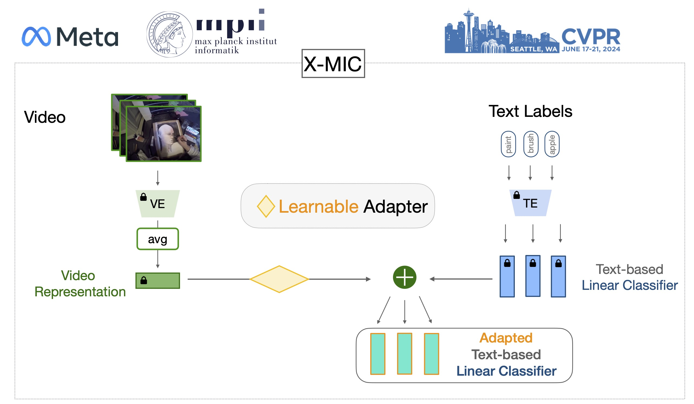

# X-MIC: Cross-Modal Instance Conditioning for Egocentric Action Generalization, CVPR 2024
[paper](https://arxiv.org/pdf/2403.19811v1.pdf), 
[video](https://www.youtube.com/watch?v=BHORqpBAPJU&t=4s)




## <span style="color:#005b96">Datasets</span> 

[Epic-Kitchens](https://github.com/epic-kitchens/epic-kitchens-download-scripts) (we used rgb frames) 

[Ego4D](https://ego4d-data.org/) (we used fho subset)

---
### Hand-crops (this step can be skipped to run basic version): 

Epic: 
- download hand crops for epic kitchens from the following [repo](https://github.com/epic-kitchens/epic-kitchens-100-hand-object-bboxes)

- we preprocess the provided crops by applying union on the objects that touch with hands and all visible hands. We keep the default parameters from the respective library. 

- Put in a pickle in a format: dict[segment_id][frame_idx] = (left, top, right, bottom)  
  (Otherwise, the library works too long if used without preextracting and preprocessing)

- save file with the name:`hand_thd0.8_obj_thd0.01_ONLY_inter_obj_with_HANDS_v2`

Download hand crops detection here for Ego4D and apply similar preprocessing: https://github.com/Chuhanxx/helping_hand_for_egocentric_videos

---

### Splits:

All splits of shared and unique (novel) noun and verb classes are in folder [anno/](/https://github.com/annusha/xmic/anno) 

****
## <span style="color:#005b96">Prerequisites</span>  

 

- follow [CoOp](https://github.com/KaiyangZhou/CoOp) to install prerequisites. However, skip installation of Dassl as its modified version is already integrated into the framework and the requirements will be installed during the next step
- Go to the Dassl folder and run:

```
cd x-mic/Dassl.pytorch

# Install dependencies
pip install -r requirements.txt

# Install this library (no need to re-build if the source code is modified)
python setup.py develop
```

- [In case of no internet connection during training] In general, CLIP model will be downloaded automatically. However, in case if you do not have internet connection during training, download CLIP
[vit-b-16](https://openaipublic.azureedge.net/clip/models/5806e77cd80f8b59890b7e101eabd078d9fb84e6937f9e85e4ecb61988df416f/ViT-B-16.pt) manually and set the path in ‘x-mic/clip/clip’ as a default parameter in _download function “root” parameter.

**** 
## <span style="color:#005b96">Extract features for faster training and evaluation</span>   

<span style="color:pink">this step also can be skipped</span>   

### Full frames

Epic config: `extract_EPIC_clip_vitb16_segments.yaml` 

To change: 

`DATASET.ROOT` - where your dataset is located with the structure `DATASET.ROOT/annotations`, `DATASET.ROOT/epic_kitchens_videos_256ss`

and `OUTPUT_DIR`

Ego config: `extract_EGO4D_clip_vitb16.yaml`

To change: 

DATASET.ROOT - where your dataset is located with the structure DATASET.ROOT/annotations, DATASET.ROOT/`epic_kitchens_videos_256ss`

`DATA.PATH_TO_DATA_DIR:` - path to annotations 

`DATA.PATH_PREFIX:`   - path to videos

`DATASET.ROOT`  - path to videos (same as path_prefix)

and `OUTPUT_DIR`

--- 
### Hand Crops:

Epic config: `extract_EPIC_clip_vitb16_segments_handcrops.yaml `

see full frames + 

DATASET.DETECTION_ROOT - path to hand crop annotations

Ego4d config: extract_EGO4D_clip_vitb16_handcrops.yaml 

--- 
### Run the scrips:

To run the script on a subset distributed over 8 gpus:

`export OMP_NUM_THREADS=64; export NCCL_ASYNC_ERROR_HANDLING=1; torchrun --standalone --nproc_per_node=8 --nnodes 1 feat_extractor_segments_distributed.py --config_name XX --split YY --distributed --seed 42` 

To run the script on a subset on a single gpu:
`python feat_extractor_segments.py --config_name` XX `--split YY --div 0`

XX - config name without “.yaml” extension and folder

YY - train or validation

Similarly, features can be extracted with [DINO](https://github.com/facebookresearch/dino) and [Lavila](https://github.com/facebookresearch/LaViLa) models. 

****
## <span style="color:#005b96">Run Training and Eval</span>

Config params: 

DATA.`PATH_TO_DATA_DIR` - Ego4D dataset annotations location

DATA.`PATH_PREFIX` - Ego4D features that will be classified with adopted classifier - best results with hand cropped frames

DATA.`PATH_PREFIX_DINO` - Ego4D  features that will be adopted - best results with hand cropped frames

DATA.`PATH_PREFIX_DINO`2 - Ego4D  features that will be adopted. This and previous features will be combined in the adaptation module - best results with full frames

DATALOADER.`FEATURES_NAME` - Epic features that will be classified with adopted classifier - best results with hand cropped frames

DATALOADER.`FEATURES_NAME_DINO` - Epic  features that will be adopted - best results with hand cropped frames

DATALOADER.`FEATURES_NAME_DINO2` - Epic  features that will be adopted. This and previous features will be combined in the adaptation module - best results with full frames

note that all these features can be the same. If use the model without hand crops, set DATALOADER.`USE_DINO_FEATURES2` = False

Set resolution of conditioning features in DATALOADER.`DINO_DIM` if it’s different from 512

If only one dataset is available, disable cross-dataset evaluation by setting TEST.CROSS_DATASET.EVAL = False

### Run the scrips

train X-MIC config: XMIC_vitb16.yaml

setup data or feature paths for one or two datasets

XX - name of the config file located in scripts/configs folder

With single gpu:

Epic nouns: 

`sh scripts/baselines/epic_gpu1.sh noun XX`

Epic verbs: 

`sh scripts/baselines/epic_gpu1.sh verb XX`

Ego4d nouns:

`sh scripts/baselines/ego_gpu1.sh noun XX`

Ego4d verbs:

`sh scripts/baselines/ego_gpu1.sh verb XX`

With 8 gpus: 

Epic nouns: 

`sh scripts/baselines/epic_gpu8.sh noun XX`

Epic verbs: 

`sh scripts/baselines/epic_gpu8.sh verb XX`

Ego4d nouns:

`sh scripts/baselines/ego_gpu8.sh noun XX`

Ego4d verbs:

`sh scripts/baselines/ego_gpu8.sh verb XX`

****
## <span style="color:#005b96">Tips</span>

- Model code is [trainers/xmic.py](trainers/xmic.py)
- To add additional trainer include it also in [train.py](train.py) or [train_dist.py](train_dist.py)

****
## <span style="color:fuchsia">Important Note</span>


Unfortunately, after my internship all models and data were deleted due to internal refactoring.  Therefore, I lost all the pretrained models, parts of code and could not make a final verification of the code. 

Feel free to connect with me via email in case of any questions. 

I sincerely apologise for the inconvenience it may cause. 

****
## <span style="color:#005b96">Citation</span>


If you use our work, please consider citing:
```*bibtex*

@inproceedings{kukleva2024xmic,
  title={X-MIC: Cross-Modal Instance Conditioning for Egocentric Action Generalization},
  author={Kukleva, Anna and Sener, Fadime and Remelli, Edoardo and Tekin, Bugra and Sauser, Eric and Schiele, Bernt and Ma, Shugao},
  booktitle={Proceedings of the IEEE/CVF Conference on Computer Vision and Pattern Recognition},
  year={2024}
}

```

****
## <span style="color:#005b96">Acknowledgements</span>


The code is based on [CoOp](https://github.com/KaiyangZhou/CoOp?tab=readme-ov-file) and [Maple](https://github.com/muzairkhattak/multimodal-prompt-learning/tree/main) repos